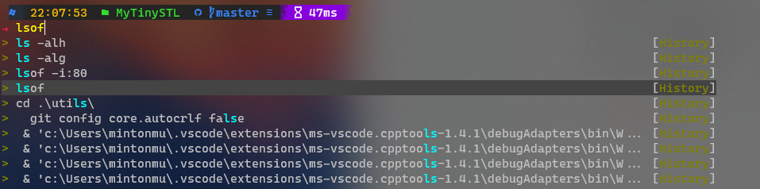

# Windows Prompt

本教程主要是针对Windows10-11系统上的PowerShell进行相关的易用性美化，本教程中的配置都是本人认为日常会用到的一些配置，下面开始正文：

### Step1：概述

本教程在实践的时候统一使用`PowerShell 7` 作为配置的基底，所以并不完全适用于其他的Shell 进行相关的配置。最终配置效果如下图展示：


### Step2:安装与配置

- 1.安装PowerShell 7
  - 安装方式有两种：I.Micosoft Store  II.Github


安装完毕Powershell 7之后我们便可以在Windows Terminal 中找到它的身影：


那么我们需要做如下两件事，第一件事 需要将Powershell 设置为默认使用的Shell ，其次将其在列表的位置排在一位，只需要在json中把Powershell的块放在数组第一个即可：


- [NerdFronts](https://www.nerdfonts.com/font-downloads)——CaskaydiaCove Nerd Front 字体安装


安装完毕之后，我们需要在Windows Terminal中进行设定，这样保证我们之后在配置的时候不会出现乱码的情况：


- 安装[Oh-My-Posh](https://ohmyposh.dev/docs/)


这里Oh My Posh为我们提供了三种安装方式，由于我这里是大陆的原因Winget目前并不好用，所以我只能选择使用scoop或者chocolatey进行安装

下面是scoop和chocolatey的安装方式：

```powershell
#scoop
Invoke-Expression (New-Object System.Net.WebClient).DownloadString('https://get.scoop.sh')
# or shorter
iwr -useb get.scoop.sh | iex
#chocolatey
Set-ExecutionPolicy Bypass -Scope Process -Force; [System.Net.ServicePointManager]::SecurityProtocol = [System.Net.ServicePointManager]::SecurityProtocol -bor 3072; iex ((New-Object System.Net.WebClient).DownloadString('https://community.chocolatey.org/install.ps1'))
```

安装完毕之后，就可以正式来安装我们的Oh My Posh了：

```powershell
#scoop
scoop install https://github.com/JanDeDobbeleer/oh-my-posh/releases/latest/download/oh-my-posh.json
#chocolatey
choco install oh-my-posh
```

再次，Oh My Posh就算是安装完毕了，可以在`cmd`或者`PowerShell`输入*oh-my-posh.exe*进行测试，如果结果如下图所示，那么就代表安装成功了。


- 2.编写配置文件

首先打开PowerShell7 之后输入如下的指令，得到如下的输出：

```powershell
echo $PROFILE
```


同时通过下列指令进入配置文件所在的目录：

```
explorer.exe C:\User\mintonmu\Documents\PowerShell\
```


我们会发现当前目录下，并没有命令中显示的配置文件，此时我们需要自己进行新建可以自动手动新建一个修改成上述`Microsoft.PowerShell_profile.ps1`的名字即可，同时`config.json`也是相同的操作，也可以使用如下的命令，如下图所示：

```powershell
New-Item -Path "C:\User\mintonmu\Documents\PowerShell\
touch\Microsoft.PowerShell_profile.ps1" -ItemType File
New-Item -Path "C:\User\mintonmu\Documents\PowerShell\
touch\config.json" -ItemType File
```


接下来我们就可以在配置文件里面编写配置了，我是习惯使用vscode 进行代码编辑了，首先需要编辑的配置文件是`Microsoft.PowerShell_profile.ps1`，需要在该文件里面添加如下代码：

```powershell
oh-my-posh --init --shell pwsh --config C:\Users\mintonmu\Documents\PowerShell\config.json | Invoke-Expression
```


编辑完毕保存之后，我们*重新启动Powershell 7* 并且在命令行中输入

```powershell
. $PROFILE
```


这里提示我们还没有设定config文件，接下来我们就需要进行config文件的编辑了，config文件可以在我的github仓库中找到大家直接下载到本地把内容复制就可以了，编辑完毕config.json文件之后，我们需要==再执行一遍==：
```powershell
. $PROFILE
```
> 注意：如果用户不需要自定义config.json 文件，则不需要获取config文件，本教程主要偏向于DIY个人的配置文件向

那么现在的效果就可以是如下图所示了:


接下来我们需要安装文件目录图标，这样方便让我们更加容易分辨不同的文件类型，需要执行一下的命令完成安装操作：

```powershell
Install-Module -Name Terminal-Icons
```

完全成功之后，我们就可以使用Terminal-Icons模块了，接下来我们需要启用这个模块，需要编辑的配置文件是`Microsoft.PowerShell_profile.ps1`，编辑完毕之后就可以重新应用一次配置文件了：

```powershell
Import-Module -Name Terminal-Icons
```

```powershell
. $PROFILE
```

效果如下图：


最后，我们需要配置的是PSReadLine模块，这样我们可以自定义快捷键，比如可以定义为Windows或者Emacs类型的快捷键，首先我们还是先进行安装配置：

```powershell
Install-Module PSReadLine -AllowPrerelease -Force

# Install-Module PSReadLine
```

安装完毕之后，我们同样需要在`Microsoft.PowerShell_profile.ps1`中进行编辑，添加如下行：

```powershell
if ($host.Name -eq 'ConsoleHost')
{
    Import-Module PSReadLine
}
```

接下来，我们需要开始历史上下键索引选择的功能


同时在配置文件中添加如下行，然后需要在终端中应用，或者开启新终端更新配置文件：

```powershell
Set-PSReadLineKeyHandler -Key UpArrow -Function HistorySearchBackward
Set-PSReadLineKeyHandler -Key DownArrow -Function HistorySearchForward
```

```powershell
. $PROFILE
```

配置完毕之后的效果如下图所示：



到这里我们配置就算基本完成了，如果后期有其他配置我会继续更新这个repo的，如果大家喜欢的话请持续关注我的哔哩哔哩频道哦~
